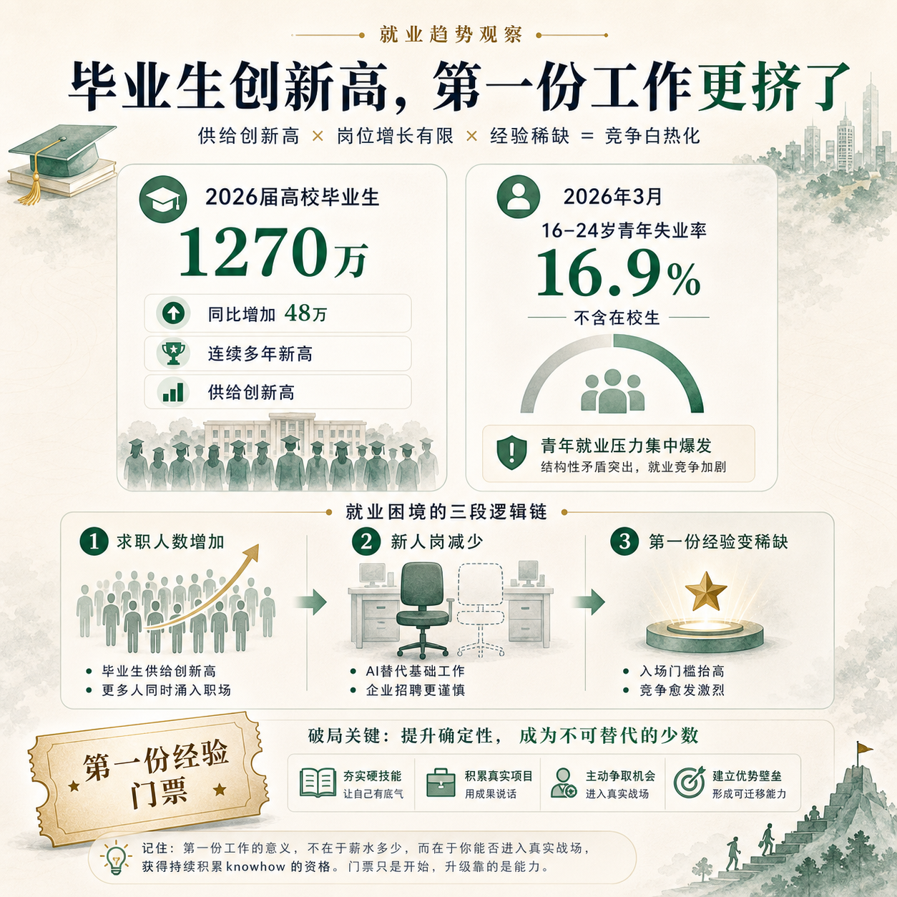
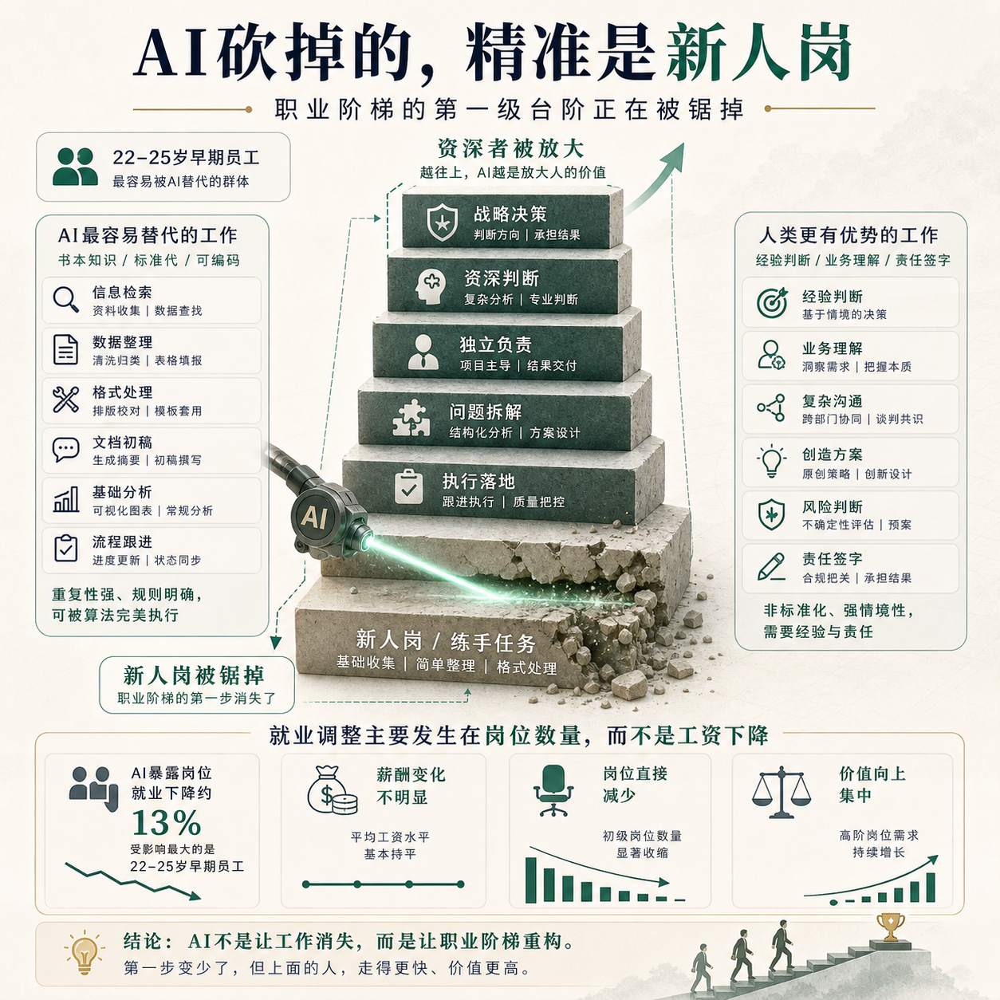
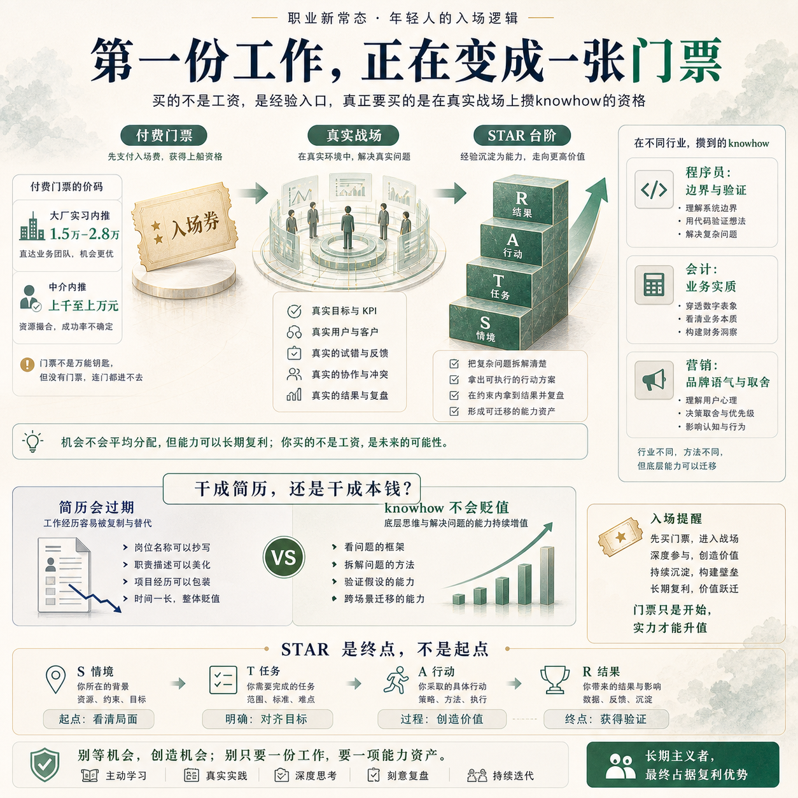

# 未来，年轻人的第一份工作，可能得自己花钱买

**作者：瑜见棋盘 | 战略从业者 · 棋盘视角**

2026年的毕业季，有两个数字摆在一起，格外刺眼。

一个是 1270 万——这是教育部预计的 2026 届全国普通高校毕业生规模，同比再增 48 万，连续多年创历史新高。另一个是 16.9%——这是国家统计局公布的 2026 年 3 月、不含在校生的 16–24 岁青年失业率，结束了此前的“六连降”，同比仍高于上年 0.4 个百分点。

可与此同时，还有另一件事正在悄悄发生：在某宝和各类中介的报价单上，一个大厂实习的内推价是 1.5 万到 2.8 万，实习三个月、日薪 200 元、走人事、支持背调。

求职的人多到挤不进门，却又有人反过来，花钱去买一个上班的机会。

把这几件事放在一起，我得出一个听起来很荒诞、但我认为正在成真的判断：**未来年轻人的第一份工作，大概率得自己付钱，才能上。**

这篇文章，我想认真论证这个判断——它为什么会发生，数据是否支持，以及如果它成真，年轻人该怎么应对。

---

## 一、先看清楚：AI 砍掉的，精准地是“新人岗”

我们过去担心 AI 取代人，是个笼统的恐慌。2025 年 8 月，斯坦福数字经济实验室的 Brynjolfsson 等人发布了一篇题为《煤矿里的金丝雀？》(Canaries in the Coal Mine?) 的论文，后续版本在 2025 年 11 月更新。它用全美最大薪资服务商 ADP 的高频数据，第一次把这件事精确化了：冲击不是均匀的，它精准地落在年轻人身上。

论文给出六个事实，其中最关键的一条是：自生成式 AI 被广泛采用以来，在受 AI 影响最严重的职业里，在控制了公司层面的冲击后，22–25 岁处于职业生涯早期的员工，就业率仍相对下降了约 16%；而同样岗位上经验更丰富的年长员工，就业则保持稳定甚至持续增长。

更值得注意的是论文的另一个发现：**劳动力市场的调整，主要通过“就业”而非“薪酬”实现**——也就是说，不是工资降了，而是岗位直接没了。而且这种下降，集中在那些“AI 更可能自动化、而非增强人类”的职业里。

一句话：被砍掉的不是“人”，是“新人岗”。职业阶梯的第一级台阶，正在被锯掉。

---

## 二、为什么偏偏是年轻人？

数据告诉我们“发生了什么”，但更冷的是它背后的机制。

斯坦福那篇论文给出的解释很关键：AI 最擅长替代的，是能从教科书里学到的、标准化、可编码的知识；它最难替代的，是经验沉淀出来的诀窍和判断。

而年轻人初入职场，手里恰恰只有前者——书本知识。这就构成一个残酷的错位：**年轻人最擅长的事，正好是 AI 最先学会的事。**

这里有一个值得玩味的反例。多年前，当 AI 开始能读 X 光片、准确率不输部分初级放射科医生时，业界一片惊呼，说放射科医生要被取代了。结果美国劳工统计局的数据显示，放射科医生的就业人数不降反增，预计 2024–2034 年的增速还高于全行业平均水平。原因是：AI 提效让检查量大涨，需要最终签字负责的资深医生，反而更多了。

区别就在这里：**资深的人被 AI 放大了价值，而初级的“练手新人”，失去了存在的理由。** AI 不消灭一个职业，它抽掉这个职业的底层台阶。

---

## 三、关键的一环：经验，变成了奢侈品

把前两层连起来，一个新的稀缺品就诞生了——工作经验本身。

过去公司愿意养新人，本质是一笔投资：容忍你低效、付钱让你边做边学，换取未来的熟手。但当 AI 比新人又快、又便宜、又不用带教，这笔投资的逻辑就崩了。**企业养新人的经济动机，被 AI 抽掉了。**

于是招聘市场陷入一个死循环：人人都要“有经验的”，却没有人愿意提供“获得第一份经验”的机会。经验，从前是工作的副产品，如今成了入职的前置条件。

而经济学有一条铁律：**任何变得稀缺、又人人都需要的东西，都会被标上价格。** 当“第一份经验”成了稀缺品，年轻人就必然要为它付费。

这，就是开头那个判断的真正含义：不是付钱给公司打工，而是自费购买一张进入职场的门票。

---

## 四、它不是预言，是已经标好价的现实

如果这还停留在推理，那它只是一个观点。但当我去查实际的市场行情时，发现这张“门票”早已明码标价。2025 年的多份调查报道显示，付费实习已经形成一条成熟的灰色产业链：

| 付费形态 | 真实价码 | 说明 |
|---|---|---|
| 大厂实习内推 | 1.5 万–2.8 万 / 3个月 | 日薪 200 元，走人事、支持背调 |
| 中介“内推/保录取” | 上千元至上万元不等 | 部分甚至代开实习证明 |

这些钱买的不是工资，而是一行简历经历。法律明令禁止用人单位向求职者收费，但第三方中介的“付费内推”，恰好钻进了监管的灰色地带——有人花了钱，最后却“鸡飞蛋打”。

所以，“付费上班”没有以违法的形式出现，却以“付费买门票”的形式，真实地发生了。它的本质只有一个：**本该由企业承担的“养新人成本”，正在被悄悄转移到年轻人自己身上。**

---

## 五、所以，被迫买了门票的年轻人，该怎么干这第一份工作？

讲到这儿，可能有人会说：那答案不就是去做 AI 替代不了的判断、去做敢签字负责的人吗？

关于“AI 时代什么样的人不被替代”，我在之前那篇**[《裁了27万人之后，他们又悄悄把人叫回来了》](https://mp.weixin.qq.com/s/PrGHiTM2lz6vCvDnWJPbzA)**里，已经用 STAR（养料者、翻译者、判官、信任者）讲过一轮，这里不再展开。

但我必须说一句实话：**STAR 是终点，不是起点。** 你让一个刚毕业、连工卡都还没焐热的年轻人，去“做判断、签字、负责”——这是空话。判官的位置，是要拿经验和战绩换的，他现在根本够不着。

所以这篇文章真正要回答的，是那个被架在中间的问题：**如果你不得不花钱买下第一份工作，那从入职到够得着 STAR 之间的这段路，你具体该怎么走？**

我的答案只有一句：**既然这份工作是你花钱买的，你就绝不能浑浑噩噩地把它干完。你要在干活的同时，刻意去攒那些 AI 替不了、别人拿不走的 knowhow。**

什么叫“刻意攒 knowhow”？不同行业，长得很不一样。我举三个具体的：

**如果你是初级程序员——**
AI 现在能轻松接管的，是纯切图的前端、写增删改查的初级后端、套模板做后台的活，这些任务清晰、出错好查，正是 AI 最擅长的那一类。一个用 AI 工作流的工程师，完成 CRUD 类任务的效率能提升 73%。所以你浑浑噩噩地写一年增删改查，攒下的经验等于零。但同一份工作里，有一件事 AI 替不了：**拿到任务后，先闭眼把“用户会怎么用、会踩哪些边界、出错怎么恢复”列一遍，再让 AI 去写代码**。这个“想清楚边界、设计验证”的动作，就是你要攒的 knowhow——它通向的，是 STAR 里那个“敢为系统签字”的判官。

**如果你是初级会计——**
深圳福田已经有 70 名“AI 数智员工”上岗，公文审核时间缩短 90%、准确率 95%。凭证录入、报表生成这种活，AI 一定会拿走。但一位老会计记录过一个真实“乌龙”：公司收到一笔用于买设备的政府补贴，AI 仅凭“补贴”两个字，就直接计入了营业外收入，导致当期利润虚增——因为**AI 不理解这笔钱的实际用途**。你要攒的，恰恰是这个：**搞懂每一笔账背后的业务实质、看出 AI 的处理哪里不对**。这就是 STAR 里“翻译者”的雏形——把业务的真实含义，翻译成账面的正确判断。

**如果你是初级营销——**
AI 能批量生成文案、做多语言初稿润色、清洗海量数据，一个资深从业者甚至断言“品牌营销的活 AI 能干掉 80%”。如果你只会让 AI 出文案，那你随时可被替换。但 AI 写出来的东西有个通病：**没有品牌的语气、没有战略的取舍、建立不了情感连接**。所以你要攒的，是“这个季度到底该主推哪条产品线、这个品牌该用什么腔调说话”的判断——这是 STAR 里“养料者”的起点：你得先成为最懂这个品牌、这群用户的人，而那些数据，AI 从没见过。

你看，三个行业，动作各不相同，但底层逻辑是同一条：**AI 把“执行”那一半拿走了，而它拿不走的另一半——理解业务、看出错误、做出取舍——恰恰要靠你在这第一份工作里，一天天攒出来。**

这，才是那张昂贵门票真正的价值：**它买的不是一份工资，而是一个“在真实战场上攒 knowhow”的资格。** 浑浑噩噩的人，花了钱也只是买了三个月的简历；清醒的人，会把这三个月，变成够向 STAR 的第一级台阶。

---

## 写在最后

回到开头那 1270 万毕业生，和那些明码标价的实习门票。

“付费上班”这个判断，字面是错的——没有公司会真的收你工资；但方向是对的：**第一份职场经验，正在从企业免费提供的福利，变成你必须自己投资的资产。**

可投资，就得讲回报。同样是被迫花掉的这笔钱和这段时间，有人买回三个月就作废的一行简历，有人却攒下了 AI 替不了的 knowhow——后者，才是真正不会贬值的资产。

在棋盘上，车有车的走法，马有马的走法，没有哪颗子天生就比谁重要。时代锯掉了卒惯常的进路，但从不阻止一颗卒，在过河的每一步里，悄悄把自己走成别的样子。

你买下的这第一份工作，打算把它干成简历，还是干成本钱？

我是瑜见棋盘，一名拥有 10 年经验的战略从业者，持续用棋盘视角，看清商业竞争的真实格局。
